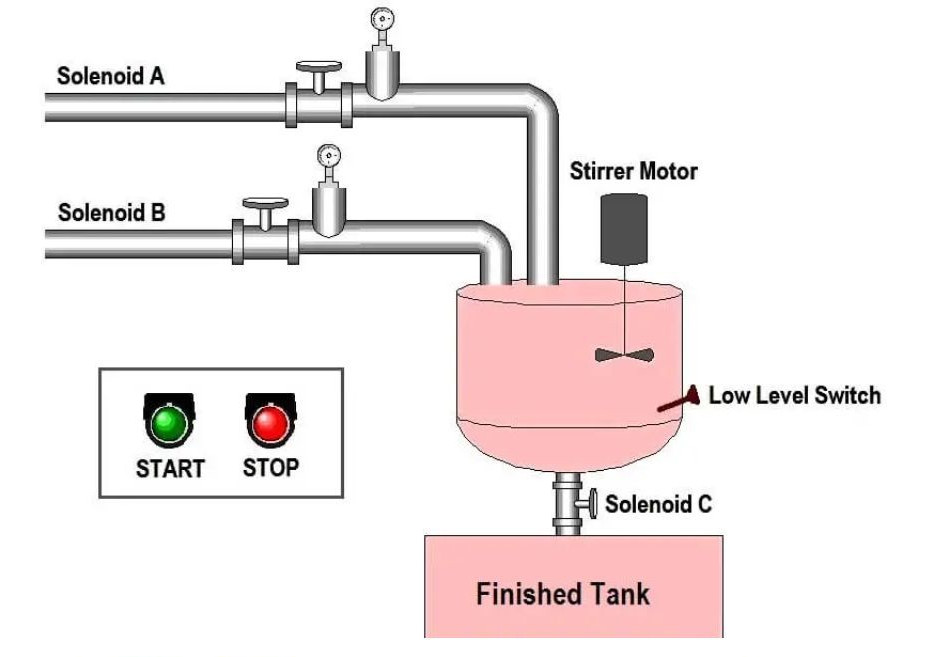

# PLC Programming Example for a Batch Mixing Process – Full Breakdown

This image represents a simple batch mixing process automated using a PLC (Programmable Logic Controller). The system automatically fills, mixes, and discharges liquid into a finished tank using solenoid valves, flow meters, a stirrer motor, and a low-level switch.

## COMPONENTS IN THE SYSTEM

- Solenoid A. Controls the flow of Liquid 1
- Solenoid B. Controls the flow of Liquid 2
- Solenoid C. Discharges the final mixed product
- Stirrer Motor. Mixes the contents inside the tank
- Low-Level Switch. Detects when the tank is empty
- Start/Stop Push Buttons. Operator input to control the process
- Flow Meters. Count the amount of liquid filled based on pulses
- PLC with Ladder Logic Program. Controls the entire operation

## PROCESS FLOW

Step 1: START Button is Pressed
This sets a bit B3:0/0 which acts as the master start signal.
This initiates the sequence.

Step 2: Solenoid A (Liquid 1 Filling)
When B3:0/0 is ON:
Solenoid A opens.
Flow meter starts counting incoming pulses.
The CTU counter (C5:0) counts the pulses.
Once the preset count (e.g. 100 pulses) is reached, Solenoid A turns OFF.
This ensures an exact quantity of Liquid 1 is added.

Step 3: Solenoid B (Liquid 2 Filling)
After Counter C5:0 is done:
Solenoid B opens.
Second Flow meter counts the pulses.
A new counter (C5:1) counts until the preset value is reached.
Solenoid B turns OFF after the target is met.

Step 4: Mixing Operation
(Not shown in detail in this image, but commonly used)
Once both liquids are filled, the stirrer motor turns ON.
It runs for a set time using a TON timer (e.g., 30 seconds).
Then it turns OFF automatically.

Step 5: Discharge to Finished Tank
Solenoid C opens to discharge the mixed product.
A Low-Level Switch detects when the tank is empty.
Once empty, Solenoid C turns OFF, and the system resets or waits for the next start command.
 Rung Function
 0000 Start/Stop logic using internal bit B3:0/0
 0001 Turn ON process based on B3:0/0
 0002 Solenoid A opens → Flow Meter counts pulses
 0003 Solenoid A turns OFF when C5:0 (Liquid 1) count completes
 0004 Solenoid B opens → Flow Meter counts pulses
 0005 Solenoid B turns OFF when C5:1 (Liquid 2) count completes
